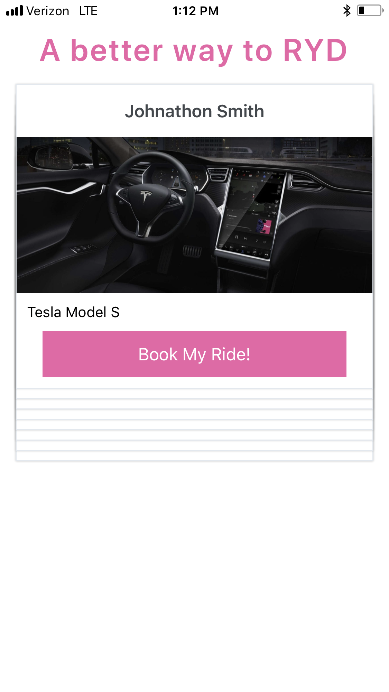
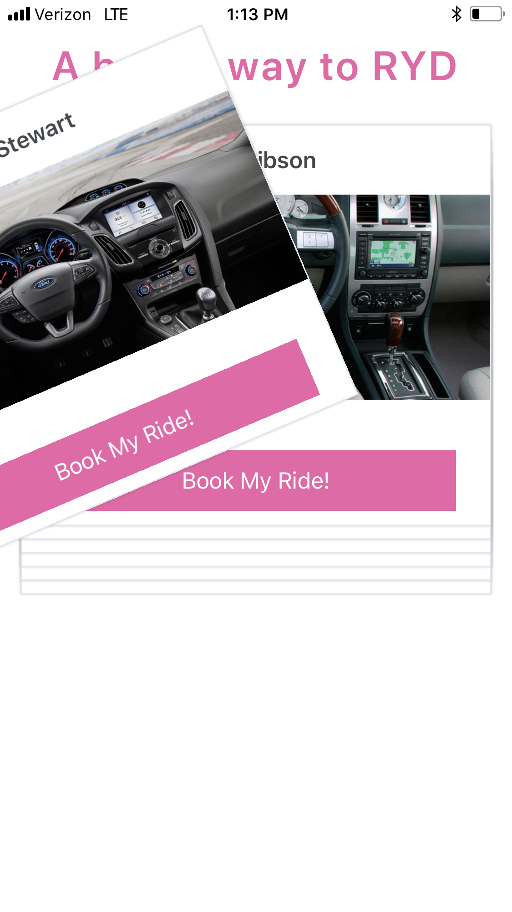

# Swipe Ryd

Preliminary UI concept for a ride sharing application that utilizes the same UX as Tinder to match drivers with riders. 

# Setting up Development Enviroment 
- Fork and/or clone repository
- npm install 
- install the expo iOS or android application
- exp start

# Technical Stack 
- JavaScript
- React-Native 